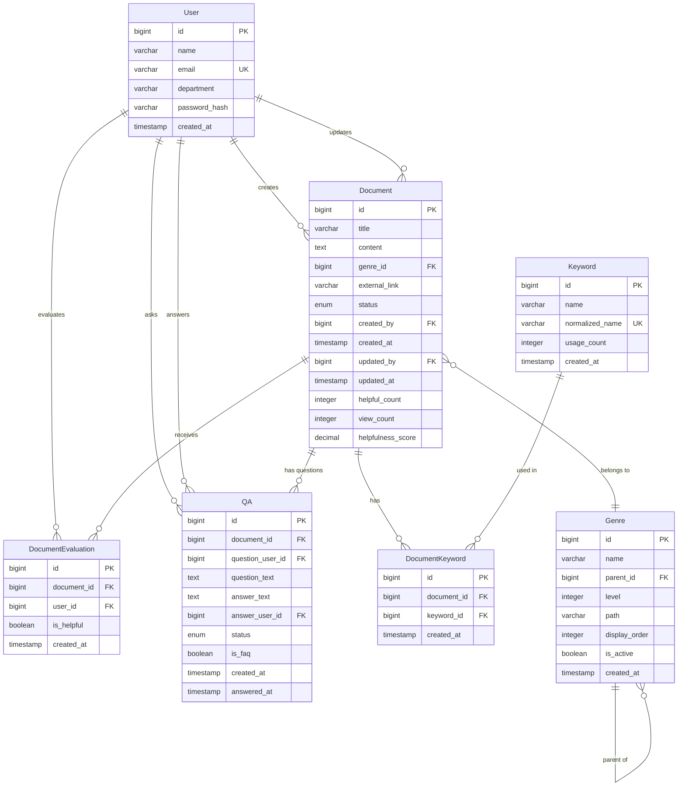

```mermaid
erDiagram
    User ||--o{ Document : creates
    User ||--o{ Document : updates
    User ||--o{ DocumentEvaluation : evaluates
    User ||--o{ QA : asks
    User ||--o{ QA : answers
    
    Document ||--o{ DocumentKeyword : has
    Document }o--|| Genre : "belongs to"
    Document ||--o{ DocumentEvaluation : "receives"
    Document ||--o{ QA : "has questions"
    
    Keyword ||--o{ DocumentKeyword : "used in"
    
    Genre ||--o{ Genre : "parent of"
    
    Document {
        bigint id PK
        varchar title
        text content
        bigint genre_id FK
        varchar external_link
        enum status
        bigint created_by FK
        timestamp created_at
        bigint updated_by FK
        timestamp updated_at
        integer helpful_count
        integer view_count
        decimal helpfulness_score
    }
    
    Genre {
        bigint id PK
        varchar name
        bigint parent_id FK
        integer level
        varchar path
        integer display_order
        boolean is_active
        timestamp created_at
    }
    
    Keyword {
        bigint id PK
        varchar name
        varchar normalized_name UK
        integer usage_count
        timestamp created_at
    }
    
    DocumentKeyword {
        bigint id PK
        bigint document_id FK
        bigint keyword_id FK
        timestamp created_at
    }
    
    User {
        bigint id PK
        varchar name
        varchar email UK
        varchar department
        varchar password_hash
        timestamp created_at
    }
    
    DocumentEvaluation {
        bigint id PK
        bigint document_id FK
        bigint user_id FK
        boolean is_helpful
        timestamp created_at
    }
    
    QA {
        bigint id PK
        bigint document_id FK
        bigint question_user_id FK
        text question_text
        text answer_text
        bigint answer_user_id FK
        enum status
        boolean is_faq
        timestamp created_at
        timestamp answered_at
    }
```